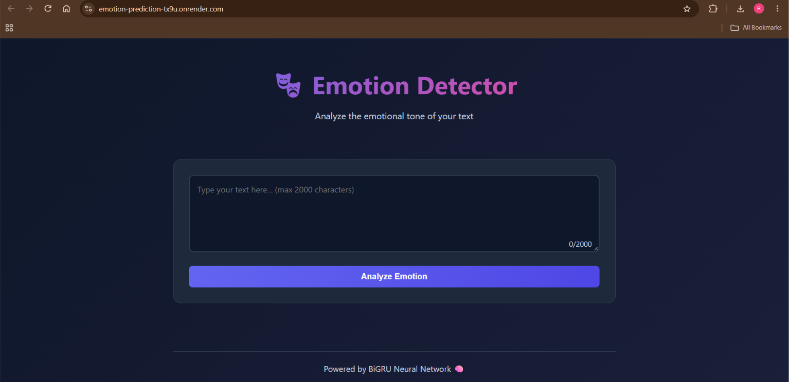
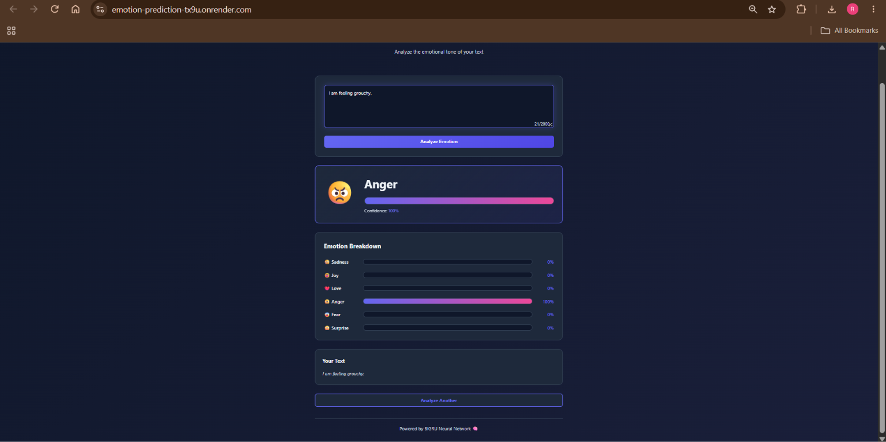

# Emotion Predictor

### Emotion Prediction using Bidirectional GRU with FastAPI

## Project Overview

A Deep Learning application that predicts emotions from text using a **Bidirectional GRU (Bi-GRU)** model.

The model classifies text into 6 emotions:

- Sadness
- Joy
- Love
- Anger
- Fear
- Surprise

I tested **Simple RNN, LSTM, GRU, and Bidirectional GRU** models. Bidirectional GRU achieved the highest accuracy and was selected as the final model.

The model is served using **FastAPI** and deployed on **Render**.

## Live Demo

https://emotion-prediction-tx9u.onrender.com

## Model Accuracy

| Model | Accuracy |
|---|---:|
| Simple RNN | 29.05% |
| LSTM | 11.15% |
| GRU | 8.25% |
| **Bidirectional GRU** | **92.70%** |

## Files Description

- **Sentimental_Analysis.ipynb** - Model training and experiments
- **main.py** - FastAPI backend
- **Artifacts/BiGRU_Model.keras** - Trained Bi-GRU model
- **Artifacts/tokenizer.pkl** - Saved tokenizer
- **static/** - Frontend files
- **requirements.txt** - Dependencies
- **README.md** - Project documentation

## Technologies Used

- Python
- TensorFlow / Keras
- NumPy
- FastAPI
- Uvicorn
- HTML / CSS / JavaScript
- Render

## Features

✓ Predicts 6 emotions from text  
✓ Tested multiple RNN architectures  
✓ Bidirectional GRU model  
✓ Confidence score and emotion probabilities  
✓ FastAPI backend  
✓ Deployed on Render

## How to Run

1. Install dependencies:

```bash
pip install -r requirements.txt
```

2. Run the FastAPI server:

```bash
uvicorn main:app --reload
```

3. Open:

```text
http://127.0.0.1:8000
```

## Project Screenshots

### App Interface



### Emotion Prediction



## Project Structure

```text
Emotion-Predictor/
├── Artifacts/
│   ├── BiGRU_Model.keras
│   └── tokenizer.pkl
├── static/
├── screenshots/
│   ├── interface.png
│   └── prediction.png
├── Sentimental_Analysis.ipynb
├── main.py
├── requirements.txt
└── README.md
```

## Author

**Riyansh**
